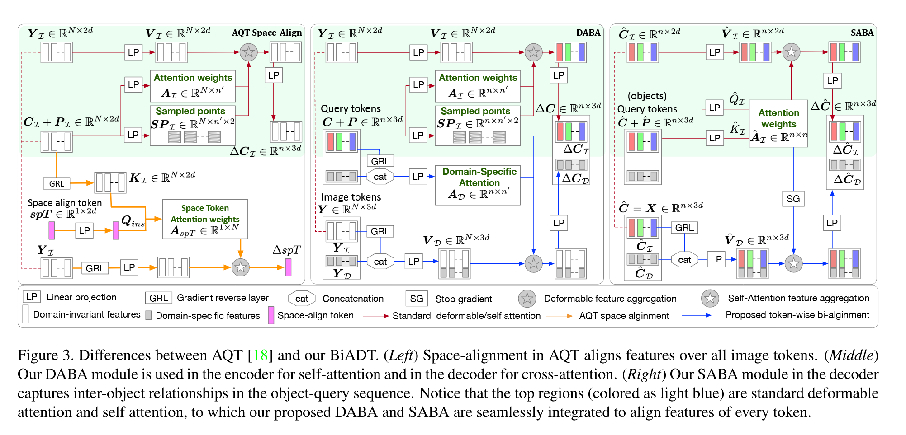

##### 1.Diff-Retinex: Rethinking Low-light Image Enhancement with A Generative  Diffusion Model

##### 2.Bird’s-Eye-View Scene Graph for Vision-Language Navigation

##### 3.PVT++: A Simple End-to-End Latency-Aware Visual Tracking Framework

##### 4.GameFormer: Game-theoretic Modeling and Learning of Transformer-based Interactive Prediction and Planning for Autonomous Driving

##### 5.Towards Better Robustness against Common Corruptions for Unsupervised Domain Adaptation

##### 6.Learning in Imperfect Environment: Multi-Label Classification with Long-Tailed Distribution and Partial Labels

##### 7.Supervised Homography Learning with Realistic Dataset Generation

##### 8.E2E-LOAD: End-to-End Long-form Online Action Detection

##### 9.Enhanced Soft Label for Semi-Supervised Semantic Segmentation

##### 10.Bidirectional Alignment for Domain Adaptive Detection with Transformers

##### 11.HyperReenact: One-Shot Reenactment via Jointly Learning to Refine and  Retarget Faces

##### 12.Order-preserving Consistency Regularization  for Domain Adaptation and Generalization

##### 13.Unified Visual Relationship Detection with Vision and Language Models

##### 14.Exploring Temporal Frequency Spectrum in Deep Video Deblurring

